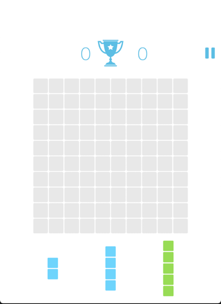
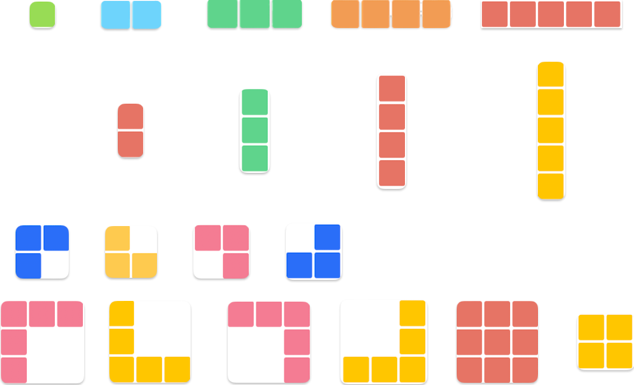

# Game - 1010!

In this project I implement my version of the game - 1010!

# The technology stack :

## Technical Requirements:
1. Implement the game "1010!" in OOP style.
2. Read and understand the JavaFX library.
3. Read and understand the JavaFX Scene Builder application.
4. Learn to divide a project into subtasks.

### The main menu will look something like this.

### The playing field will look something like this.

### The game pieces will look something like this

## About the game:
The game 1010 is one of the new puzzle games based on the Tetris principle. 
The point of the game 1010 is to earn as many points as possible by filling all the horizontal and vertical squares.

## The rules of the game: 
1. On a field of 10x10 cells you need to lay out the figures
2. At the bottom there are three pieces, which must be placed on the field in any place. There is no gravity in 1010.
3. As soon as one row or one column is filled, it is destroyed, bringing points.

Rules for scoring points:
1. When a new figure appears on the field, the  score  receives such a number of points from how many squares this figure consists
2. When a row and a column are destroyed, 10 points are added to the score, plus the figure's points.
3. When 2 or more rows or columns are destroyed, the points are multiplied by that number.
   (Example: When you destroy 3 rows the calculation of points is as follows = 10 + 10 + 10 x 3 = 60 points")